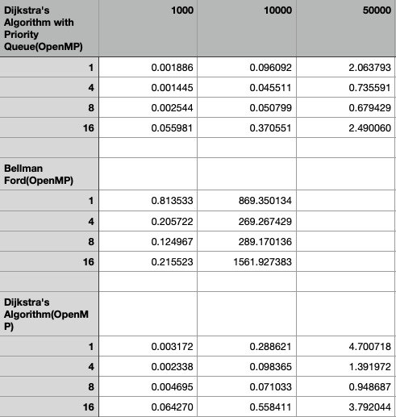

# 15-418/618 Final Project

## Parallel Dijkstra's Shortest Path Algorithm

Xinqi Wang (Andrew ID xinqiw)\
Yuou Lei (Andrew ID yuoul)


# SUMMARY

In this project, we will parallelize the classic path finding algorithm,
Dijkstra's Shortest Path Algorithm on multi-processing platforms, and analyze
the performance of the algorithm on different platforms.

# BACKGROUND

In the game developing word, finding the shortest path from the enemies
to the player is a very common and important object. Let's go back to
the era of Diablo 1, which was originally designed to be a turn-based
game but was asked to be changed to real-time game. What the developer
did is to reduce each round to a very small time to complete. In other
words, the monsters need to find their path to the player in an
extremely short time period.

There are two classic path-finding algorithms, A\* algorithm and
Dijkstra's algorithm, both of which are famous algorithm in game
developing to do the path-finding job. In this project, we will focus on
Dijkstra's algorithm, which is well studied and also widely deployed in
many other real-world applications such as network routing, path
planning, etc. The Dijkstra's algorithm is a type of greedy algorithm
and its pseudocode\[1\] is as follows:

```
Algorithm 1 Dijkstra(Graph, source)
1: for vertex v in Graph.V ertices do
2:   dist[v] ← INFINITY
3:   prev[v] ← UNDEFINED
4:   add v to Q
5: end for
6: dist[source] ← 0
7: while Q is not empty do
8:   u ← vertex in Q with min dist[u]
9:   remove u from Q
10:  for neighbor v of u still in Q do
11:      alt ← dist[u] + Graph.Edges(u, v)
12:      if alt < dist[v] then
13:         dist[v] ← alt
14:         prev[v] ← u
15:      end if
16:   end for
17: end while
18: return dist[], prev[]
```


The compute-intensive part is the while loop from lines 7 to 17.
Although the inherent dependency of the algorithm limits the amount of
parallelism that can be achieved, there is still potential benefit from
parallelizing the inner loop that updates nodes in a list iteratively.
Our project aims to analyze the performance and achievable speedup of a
parallelized Dijkstra's Algorithm in comparison to a sequential version
as well as a multi-core CPU implementation and study the effects of
different types of graphs on the performance characteristics on theses
algorithms.

# CHALLENGE

## Workload

One inherent dependency in Dijkstra's Algorithm is the fact that each
update to the shortest paths from each vertices to the source node must
be made based on the addition/introduction of the node from previous
iteration. Given the fact that Dijkstra's Algorithm is a greedy
algorithm, the *while* loop must be executed sequentially to find the
optimal solution and would be a potential bottleneck. Depending on the
way of representing the graph *G* (adjacency list or adjacency matrix)
and different graphs, the cost and pattern of memory accesses can vary
significantly. Since we want to focus on parallelizing updates to all
valid nodes for each iteration of the *while* loop, the communication
required between cores should be minimized as the updates can be done
independently.

## Constraints

For large and dense problems, we would expect a parallelized algorithm
with more cores to achieve higher speedups. However, parallelizing over
updates of shortest paths for each node can potentially suffer from
communication and synchronization costs with higher core counts since
the granularity of the task is relatively small if each task only
computes the update for one node.

# RESOURCES

We will implement and verify both sequential and parallel versions of
the algorithm on GHC machines from scratch. Performance analysis will
most likely be done on both GHC and PSC machines (if available) since we
want to evaluate final implementations with higher core counts.

# GOALS AND DELIVERABLES

## Goals

-   **75%**

    1.  Implement sequential version of Dijkstra's algorithm.

    2.  Implement the parallelized version of Dijkstra's algorithm with
        OpenMP.

    3.  Analyze the performance of both versions and speedups (1
        processor to *n* processors) on GHC/PSC machines and identify
        any bottlenecks.

-   **100%**

    1.  Implement the algorithm to run on multi-core CPU platforms.

    2.  Analyze the performance of the sequential version and the 
        parallelized versions by comparing speedups,
        identifying bottlenecks, and bench-marking performance
        characteristics of each implementation on different graph types.

    3.  Observe on which graph types (e.g. dense and sparse graphs,
        larger and smaller graphs) and with what core counts (if
        applicable) each version of the algorithm perform well and
        poorly.

-   **125%**

    1.  Implement the Dijkstra's Algorithm using message-passing model
        with OpenMPI and analyze its performance with that of the
        shared-memory model.

    2.  Compare the performance characteristics of the shared-address
        model and message-passing model to see if and how graph types
        and task granularity could affect the overall performance.

## Deliverables

For the final presentation of our results, we plan to generate different
test cases and graph types manually. For example, developing a program
to generate random adjacency matrices and store in text files that can
be read by our programs. To visualize evaluation results in a compact
and clear way, plots of the performance/speedups of each implementation
will be created and included in reports and presentations. We also plan
to show a quick demo of both the sequential version and the parallelized
versions on one of the test cases.

# PLATFORM CHOICE

We will develop and verify the functionality of all implementations on
the GHC machines first and analyze the performance of correct versions
on PSC machines. All algorithms will be implemented in C++ and we'll use
OpenMP (and OpenMPI if we do get to 125% of our goals) as the parallel
framework.

# SCHEDULE
| Week starting on | Tasks and Due Dates |
| :----: | :----: |
| 3/21 | Project proposa |
| 3/28 | Complete Sequential version of Dijkstra's Algorithm<br> Parallelism ideas and start implementation<br> **Proposal due 3/23** |
| 4/4 | Complete Parallelized version of Dijkstra's Algorithm <br>Performance analysis and draft Milestone report |
| 4/11 | Complete multi-core CPU version of Dijkstra's Algorithm<br>Performance analysis<br><b>Milestone Report due 4/11</b>|
| 4/18 |  Progress check (catch up with the timeline if falling behind)<br>CUDA version of Dijkstra's Algorithm |
| 4/25 | Final report and Presentation<br>**Final Report due 4/29** |
| 5/2 | **Project Presentation on 5/5** |

# MILESTONE
## SUMMARY
By the end of milestone, we finished implementing the sequential version of Dijkstra's algorithm, the sequential version of Bellman Ford and the parallelized versions using OpenMP of the Dijkstra's algorithm. For Dijkstra's algorithm, each iteration adds a new vertex into the visited set which is marked as the one who gets the shortest path. Hence, it is impossible to perform iterations in parallel. However, based on the idea of assignment 3, we can perform the computation of each nodes inside each iteration in parallel. That is, we assigned several nodes to each thread, and all the threads can access some global variables like global min, global node, visited array, and graph array. Then, all the threads work together to get the "shortest node" of this iteration. We also incorporated a priority queue structure in one version of the parallelized Dijkstra's algorithm and compared the performance to one without a priority queue.<br>
Inspired by the feedback on our proposal, we also implemented the Bellman Ford Algorithm, which is also a classic algorithm for finding shortest paths from a source to other nodes in a graph. Our sequential version functions correctly and we're currently still working on the parallelized implementation using OpenMP.<br>
For the dataset, we used the data from Stanford Large Network Dataset Collection \cite{snapnets}. The data set does not contain weight of each edge, hence, we implemented a Java program to randomly generate weight for each edge.

## GOALS
So far, we are on track of our proposed schedule. However, our performance analysis show that the amount of speedup from our current approach is limited by the inherent dependencies of the algorithm. According to the feedback of proposal and our current results, we decided to modify our goals to include a new shortest path algorithm, the Bellman Ford Algorithm, in place of the original multi-core cpu implementation of the algorithm because we want to focus more on the analysis of parallelization of different algorithms using different programming models. If time permits, we also want to look into some of the architectures suggested in our mentor's feedback, such as the Swarm Architectures that are useful for parallelizing hard-to-parallelize applications such ah Dijkstra's algorithm.

## DELIVERABLE
We plan to use graphs and charts to show our work in the poster session. Specifically, we intend to have an analysis chart to show the computation time and speedup of each parallel algorithm. Then, we can generate a "path graph" since we are working on "path finding" work.

## PRELIMINARY RESULTS
To measure the performance, we do the analysis of the computation time of different algorithms under different numbers of threads. The result shows that the openMP works pretty well on thread 4 when the data-set is big enough.


## UPDATED TIMELINE AS OF 4/11/22
| Week starting on | Tasks and Due Dates |
| :----: | :----: |
| 3/21 | Project proposa<br> **Proposal due 3/23** |
| 3/28 | Complete Sequential version of Dijkstra's Algorithm<br> Parallelism ideas and start implementation|
| 4/4 | Complete Parallelized version of Dijkstra's Algorithm <br>Performance analysis and draft Milestone report |
| 4/12 | Debug and Complete parallelized Bellman Ford Algorithm (Xinqi)|
| 4/14 | Performance analysis of all implementations on larger dataset and more capable machines (Yuou)|
| 4/16 | Implement message-passing versions of both algorithms (both)|
| 4/19 | Performance analysis of OpenMPI implementations (Yuou)<br>Compare results with OpenMP implementations (Xinqi)|
| 4/22 | If on track of schedule, look into Swarm Architecture|
| 4/25 | Organize current results and discussions of analyses (both)<br>Start working on final report and presentation (both)<br>**Final Report due 4/29**|
| 5/2 | **Project Presentation on 5/5**|

## ISSUES
Currently, our Bellman Ford Algorithm does not work very well, and we are working on figure out and fix the problem.<br>
Besides, we need to double-check that whether we can test our algorithms on PSC.

# REFERENCES

\[1\]Wikipedia contributors. \"Dijkstra's algorithm.\" Wikipedia, The
Free Encyclopedia. Wikipedia, The Free Encyclopedia, 16 Mar. 2022. Web.
23 Mar. 2022.
